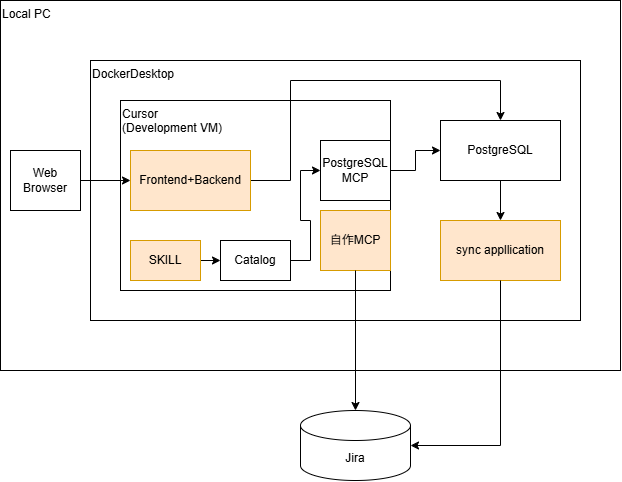

# AI活用事例カタログ ワークショップ 計画メモ

作成: 2026-09-08
状態: STEP 0（Jira 以外）完了、STEP 1〜3 のリハーサル第1回完了（2026-09-08）。詳細は `step0-setup.md` と `rehearsal-log.md`。

## 1. 目的

「AIを使うとこんなことができる」を **30分・全部ライブ** で体験してもらう。
題材は社内のAI活用事例カタログ。参加者はエンジニア。

### 伝えたいこと（最重要）

**雑に指示しても作ってはくれる。ただし手直しが多くなる。認識違いを減らすには、正しい情報（コンテキスト）と正しい指示（プロンプト）が要る。**（2026-09-09 に言い回しを確定）

オチ（まとめの次の2枚。2026-09-09 に調査して確定）:
1. 「…という形で説明しましたが」: 今日は1つずつ・シングルエージェント・人がループを回す型（仕様がまだ無い探索に向く）。実際は仕様先行（spec → plan → tasks。Spec Kit / Kiro / plan mode は同じ3段）＋ 並列（部品が独立し機械的に検査できるときだけ効く。トークンは体数以上に増える）。一つずつ直す型は速く感じるが手直しに時間を食う（METR の RCT: 19%遅いのに20%速く感じた）
2. 「ハーネスエンジニアリングと、ループエンジニアリング」: ハーネス = モデルの周りの制御系（guides: CLAUDE.md / SKILL / MCP / hooks / 権限、sensors: テスト / lint / 検査スクリプト、ratchet: 失敗から1行ずつ）。ループ = 作る→検査→直す の回し方（誰が回すか・何で止まるか・状態をどこに残すか。Ralph loop）。締め: 今日の積み上げは仕様を発見するフェーズ。次はスキーマ・指示文・ハーネスを最初に渡して並列で回す
   出典: Böckeler (martinfowler.com 2026-04) / Osmani (2026-04) / InfoWorld (2026-05) / JetBrains 調査 (2026-08)。「並列が主流」は統計が無いので断定せず「可能になった潮流」の扱い
- 宿題スライド（オチ2の次）: 「仕様先行で、もう一度作ってみる」。5段の図: ①材料（今日の配布物）→ ②仕様 SPEC.md（plan mode、受け入れ条件は検査として書く）→ ③完了条件を書く（check.sh ＋ CLAUDE.md。ハーネスという語は出さず汎用に） → ④タスク TASKS.md（独立して検査できる単位、触ってよいファイル）→ ⑤オーケストレータ（1セッション＋サブエージェント並列。子は検査が通るまで、2回で止めて報告、疑問は QUESTIONS.md）。worktree は初学者が置いていかれるので出さない。提出物は設けない（やるかやらないかは各自に任せる。2026-09-09）。締めの1行に「途中で CLAUDE.md に足した行 = 最初に渡せていなかった情報と指示」を残す。未決: トークン予算
- 2026-09-09 追記: Day 1 からオチ2（ハーネス／ループ）は削除。オチ1 に「仕様先行＋並列で効きが増す2つの設計」として1行の補足だけ残し、がっつり説明は Day 2 に寄せる（Day 2 はオチ2を保持）。宿題の①は「環境を整える」に改名
- スライドの並び（末尾）: Day 1 = まとめ → オチ1 → 宿題 → 予告 Day 2（最終ページ）。Day 2 = まとめ → オチ1 → オチ2 → 宿題

- 主役は結果ではなく **指示文4本**。貼る前に画面に出し、「どこが情報で、どこが指示か」を指してから貼る
- 対比は STEP 1 で1回だけ。雑な指示（「このURLを事例にまとめて」）で項目が欠けた出力を見せ、次に正しい指示文で8項目が揃うのを見せる
- ライブで外したときは「AIも外す」ではなく「何の情報が足りなかったか」を言い、足りない情報を足して再実行する
- まとめ: 人の仕事は「正しい情報と指示を用意すること」。具体物はカードのスキーマ、JiraのフィールドID表、読める範囲の指定。STEP 0 で人が作ったものがそのまま証拠になる

| | 中身 | 出どころ |
|---|---|---|
| 正しい情報 | カードのスキーマ、JiraのフィールドID表、接続文字列、プロジェクトキー | STEP 0 で人が作る |
| 正しい指示 | 読み取り専用、JQLを外から受けない、Streamlit 1ファイル、冪等に | 設計判断の言語化 |

### 副次的に見せたいこと

- 「ツールを配った」ではなく「仕事の流れの中にAIが複数箇所で挟まっている」こと
- AIの役割が3種類に分かれて見える: 読んで構造化する（SKILL）／外の仕組みを操作する（MCP）／コードを書く（Web画面ほか）
- 溜めた事例を会話で引ける（自作MCP）ところまで見せて初めて「溜めると効く」が伝わる
- 参加者が持ち帰るのは「自分たちの資産にもAIの入口を作れる」という感覚

## 2. 構成

| 部品 | 種別 | 役割 |
|---|---|---|
| SKILL | **当日AIが作る** | URLを読んで事例カードJSONにする。出力は Catalog（JSONファイル群） |
| Catalog | データ | SKILLの出力先。人が一瞥してからDBに入れる「間」を作る場所 |
| PostgreSQL MCP | 既製品 | CursorがCatalogをPostgreSQLに流し込むときに使う汎用MCP |
| PostgreSQL | 既製品（Docker） | ローカルの事例DB |
| Frontend+Backend | **当日AIが作る** | 人向けの入口。一覧と検索。BackendはSQLを直接実行する（MCPは経由しない） |
| sync application | **当日AIが作る** | PostgreSQL → Jira の片方向バッチ。判断が要らない処理なのでLLMを挟まない |
| Jira | 既製品 | 組織側の台帳（正本）。他の人がフォームで起票できる器 |
| 自作MCP | **当日AIが作る** | AI向けの入口。Jiraの事例プロジェクトだけを読む。読み取り専用3ツール |

同じ事例に対して **人の入口が Web画面、AIの入口が 自作MCP**。その2つを同期でつないでいる。
オレンジ（当日AIが作る4部品）は「入口を作る仕事」を全部AIに作らせている、という構図。

### ローカルとグローバルの位置づけ（2026-09-08 確定）

Jira は「ローカルのものをグローバルからアクセスできるようにしただけ」の器。関連・類似の判断をどこで担うかが、器の能力で変わる。

| | ローカル | グローバル |
|---|---|---|
| 器 | PostgreSQL（＋AGE、pgvector） | Jira |
| 関連・類似を担う場所 | DB（決定的・速い・再現する） | LLM（自作MCPが候補を渡し、LLMが読んで判断） |
| 理由 | 器が検索機構を持っている | 器が持っていないので、持っている側に寄せた |

「同じカードに、同じ問いを、器の能力に応じて別の層で解く」。これが「AIと周辺の仕組みの切り分け」の実例で、まとめで使う言葉。
LLM 側の類似判断は件数に上限がある（50件なら全件渡して選ばせれば足りる。数百件で JQL `text ~` の前絞り＋LLM の2段か、DB 側へ戻す）。「いまは件数が小さいので LLM に置いた。育ったら戻す」と条件で語る。
30分の中ではローカル側の検索は文字列一致のまま。AGE / pgvector は「この先」として口頭で触れる。

## 3. 事例カードのスキーマ

| 項目 | 備考 |
|---|---|
| タイトル | |
| 部署・役割 | `department`。10字以内の名詞1つ。グラフの辺（事例→部署）の材料（2026-09-08 追加） |
| 誰が、何に困っていたか | |
| 困りごとの型 | `problem_types`。固定8種から1〜2個。**関連事例の中心**（同じ困りごと → 同じ部署 → 共有基盤 の順）（2026-09-08 追加） |
| AIと周辺の仕組みが、何をしているか | |
| 使っている基盤 | `platforms`。正規化辞書の表記で配列。グラフの辺（事例→基盤）の材料（2026-09-08 追加） |
| 必要なデータ・基盤・運用体制 | |
| 確認できた効果 | 仮説と分ける。SKILL.md に切り分けの例を2つ書いて固定する |
| まだ仮説の効果 | |
| 出典URL | **「出典と確認日」は2列に分ける**。1列にすると「確認日が90日超」がJQLで引けない |
| 確認日 | 日付型 |

PostgreSQLの列と Jira のカスタムフィールドを1対1にする。`platforms` は PostgreSQL では `text[]`、Jira ではラベルか複数選択。
拡張の方針は「意味で入って（pgvector）、関連で広げる（AGE）」。`department` と `platforms` は後者の辺の材料で、判断を含む抽出は STEP 1 の SKILL（AI）が担い、辺を張るのは決定的な導出バッチが担う。
フィールドIDの対応表は **1モジュールに切り出し、sync application と 自作MCP の両方から読む**（2箇所に散ると片方だけ直して壊れる）。

## 4. 「0スタート」の線引き

| 分類 | 当日の状態 |
|---|---|
| コード | **0**。SKILL.md、Web画面、sync、自作MCP のファイルは当日生まれる |
| 環境 | **満タン**。PostgreSQL起動済み、Python依存導入済み、CursorにPostgreSQL MCP設定済み、Jiraプロジェクトとフィールド作成済み、トークンは環境変数に投入済み |
| 指示文 | **書いてある**。4部品を作らせるプロンプトは事前に磨き、当日は貼るだけ。ここが成功率を決める |
| データ | **大量の事例**を Catalog に準備済み（当日のSKILLライブは新規URL 1本だけ） |

## 5. 事前準備チェックリスト

### 事例
- [ ] 30〜50件の事例カードJSONを Catalog に用意する（種: ai-architecture-catalog / ai-architecture-digest のURLをSKILL相当で一括処理。「事前準備もAIでやった」が話の枕になる）
- [ ] 当日SKILLに渡す新規URLを決め、**前日に同じURLを一度通しておく**（会社ネットワークで止まる可能性）
- [ ] STEP 5 で投げる質問文を決める（例: 「経理で請求書処理に困っている。近い事例ある？」）。この質問に答えられる事例が Catalog に含まれていること

### 環境
- [ ] PostgreSQL を Docker で起動。DBロールを2つ: 読み書き（Cursor/Postgres MCP/sync用）、読み取り専用（将来の参加者向け）
- [ ] Postgres MCP を Cursor に設定。**Postgres MCP Pro（crystaldba/postgres-mcp）** を使う。`@modelcontextprotocol/server-postgres` は廃止済み・SQLインジェクション未修正なので使わない
- [ ] Python 依存を事前導入: `mcp`, `httpx`, `psycopg`, `streamlit`
- [ ] Cursor（Development VM）内から Docker Desktop 側 PostgreSQL に届く接続文字列を確認（コンテナ名解決かホスト経由か）
- [ ] Web Browser → Development VM 内 Frontend のポート転送を確認
- [ ] Jira 側: 事例プロジェクト作成、カスタムフィールド8項目作成、**フィールドIDを控える**
- [ ] Jira トークン: スコープ付き（`read:jira-work` + 書き込みは sync 用に別途）、環境変数ファイル1箇所にまとめる。sync と 自作MCP が同じファイルを読む
- [ ] Jira 権限: トークンのアカウントに事例プロジェクトしか見せない（コードの `PROJECT_KEY` 制限と二重にする）
- [ ] 一括で初期化するスクリプト（回ごとにDBとJiraを戻す）

### 指示文（4本）
- [ ] SKILL 用: カード8項目と出力JSONの形、効果/仮説の切り分け例2つ
- [ ] Web画面用: Streamlit 1ファイル、一覧と検索のみ
- [ ] sync 用: 挿入のみ、キー突合で冪等、**JiraカスタムフィールドIDの対応表を貼る**（当日探させると時間が溶ける）
- [ ] 自作MCP 用: `PROJECT_KEY`、対応表、読み取り3ツール、書き込みなし、JQLを外から受けない

### リハーサル
- [ ] ストップウォッチで1回通す。分単位の配分は見積もりなので実測で決める
- [ ] 35分を超えたら: STEP 5 を「時間があれば」に回すか、どこを削るかを決める

## 6. STEP 定義

各STEPは「指示文を見せる30秒＋生成2分＋実行1分＋修正1回」で見る。
**修正が2回目に入ったらその部品は諦めて口で補い、次へ進む**（1箇所で10分溶かさないため）。
修正は「直して」ではなく「足りなかった情報を足して再実行」の形にする。失敗の分析も「何の情報・指示が欠けていたか」で語る。逃げ道は用意しないが、失敗の扱い方だけは決めておく。

各STEPで貼る前に指示文を画面に出し、「情報」と「指示」の箇所を指す。

### STEP 1: SKILL（URL → 事例カードJSON）
- 作るもの: SKILL.md 1枚
- 見せること（対比）:
  1. 雑な指示「このURLを事例にまとめて」→ 項目が欠ける、粒度がばらつく出力
  2. 正しい指示文（スキーマ、効果/仮説の切り分け例、出力先）→ 8項目が揃う
- 人の仕事: 出力を一瞥してから次へ（自動で流さない）
- 成功条件: 8項目が埋まったJSONが1件生成される。対比で「欠けた項目」が参加者に見えること

### STEP 2: Catalog → PostgreSQL（汎用MCP経由）
- 作るもの: なし（Cursor + Postgres MCP Pro）
- 見せること: 「CatalogをDBに入れて」→ テーブル作成から挿入までCursorがSQLを書いて実行
- 成功条件: 事前準備分＋STEP 1 の1件が入る

### STEP 3: Web画面（Frontend+Backend）
- 作るもの: Streamlit 1ファイル
- 見せること: 起動 → 一覧に STEP 1 の1件が出る → 検索を1回
- 補足: この画面の寿命はローカル環境まで。Jiraが正本になった後は Confluence の Jira Issues マクロに置き換える（作り込まない）
- 成功条件: 一覧と検索が動く

### STEP 4: sync application（PostgreSQL → Jira）
- 作るもの: 挿入のみのバッチスクリプト1本
- 見せること: 生成 → 実行をバックグラウンドで走らせ、STEP 5 の生成と並列にする
- 成功条件: Jira の事例プロジェクトに全件が起票される

### STEP 5: 自作MCP（Jiraの事例プロジェクトだけを読む）
- 作るもの: MCP Python SDK 2.x（`MCPServer`）1ファイル、ツールは `find_cases` / `get_case` / `list_hypothesis_cases` の3本
- 見せること: 生成 → Cursor に設定 → 「近い事例ある？」→ 事例が返る
- 類似判断は LLM が担う（Jira は検索機構を持たないため）。`find_cases` は JQL `text ~` で候補を絞って返し、どれが近いかは LLM が読んで決める。件数が小さいうちの置き方であることを一言添える
- 参加者に見せるコードはこの1ファイルだけ。「読める範囲が1行、ツールが3つ、対応表が1つ」を30秒で指す
- 成功条件: 質問に対して Jira の事例が返る

## 7. 30分台本

| 分 | 工程 | STEP |
|---|---|---|
| 0-2 | 構成図を出す。「ここから全部作る。見てほしいのは指示文」 | - |
| 2-8 | 雑な指示で1回 → 欠けを指す → 正しい指示文を見せて貼る → 8項目が出る | 1 |
| 8-12 | 「catalog/ を全部DBに入れて」。テーブル作成から挿入まで | 2 |
| 12-17 | 指示文を見せて Web画面を作らせ、起動、一覧と検索 | 3 |
| 17-21 | 指示文を見せて（フィールドID表を指す）syncを作らせ、実行はバックグラウンド | 4 |
| 21-27 | 指示文を見せて（PROJECT_KEY と読み取り専用を指す）自作MCPを作らせ、Cursorに設定し、「近い事例ある？」 | 5 |
| 27-30 | まとめ。人の仕事＝正しい情報と指示を用意すること。STEP 0 の成果物（スキーマ、フィールドID表）を見せる | - |

正直な見積もりは40分前後。並列化と指示文の磨き込みで30分に寄せる。実測で決める。
押したときの削り順: STEP 3 の検索 → STEP 4 の説明 → STEP 2 のSQL解説。**STEP 1 の対比と STEP 5 は削らない**。

参加者に見せる優先順位: 指示文4本 ＞ STEP 1 の対比 ＞ 自作MCPのコード1枚。

## 8. 設計判断ログ

| 判断 | 理由 |
|---|---|
| 自作MCPは Jira の事例プロジェクトだけを読む | 「どこまで届くか」が `PROJECT_KEY` 1行で見える。汎用MCPは「本人が見られる全部」なのでこの行が存在しない。汎用（Confluence/Postgres MCP）との差がコードで出る |
| 自作MCPのツール引数は事例の言葉にする。JQLを外から受けない | 1本でもJQLを受けると汎用MCPに戻る |
| 自作MCPは読み取り専用3ツール。書き込みツールは作らない | 30分の制約。将来の登録ツールは「8項目が揃わなければ差し戻す」検証付きにする（周辺の仕組みが押し返す場面） |
| Backend は SQL を直接実行。MCPを叩かない | LLMがいない経路にMCPを挟む意味がない。MCPは「LLMがその場で道具を選ぶ」ための口 |
| sync はバッチ。LLM/MCPを挟まない | 決定的・冪等・再実行可能な処理。1件ずつ会話で登録すると遅い・再開できない・再現しない |
| 同期は PostgreSQL → Jira の片方向 | 双方向にすると正本が2つになる。Jira が正本になった後、Web画面は Confluence マクロに置き換える |
| Postgres MCP は crystaldba/postgres-mcp | 公式参照実装は廃止・SQLインジェクション未修正 |
| Jira トークンの置き場は1箇所 | sync と 自作MCP の両方が持つ。環境変数ファイル1つを共有 |
| 組織展開時の自作MCPは各自のスコープ付きトークンで stdio 起動 | Jira の権限と監査ログが本人に紐づく。サーバ1本にすると「クライアント→MCP」の認証問題が新しく生まれる |
| 全部ライブ。事前に作るのは環境・データ・指示文まで | ワークショップの主役は「AIが0から作る」を見せること |
| まず Claude Code で通し、Cursor は後から動作確認 | このマシンに Cursor 本体がない。MCP 設定はラッパースクリプト経由にして両方から同じものを指す |
| STEP 2 の投入は MCP だけで行う（スクリプトを書かせない） | AI が DB を操作する場面を見せるのが目的。遅さと引用符の落ちやすさは織り込む。発話に「まとめて INSERT」「重複しても壊れないように」を足して補う（2026-09-08） |
| 事前データの `confirmed_at` は当日より前の日付にする | 一覧が `confirmed_at` 降順なので、当日 STEP 1 で作った1件が先頭に来る（2026-09-08） |
| 事前データは `catalog/SEED.txt` に列挙し、初期化はそれ以外を消す | git の有無に依存せず当日分だけ消せる |
| Streamlit の待ち受けは `.env` の `STREAMLIT_ADDRESS` で切り替える | 手元だけなら 127.0.0.1、LAN の別PCから見るなら 0.0.0.0。読み取り専用で秘密情報は無いが、外向きの経路がある環境では 127.0.0.1 にする |
| STEP 5 の指示文に MCP SDK のバージョン（2.x、`MCPServer`）を明記する | SDK 2.x で `FastMCP` が改名された。書かないとAIが古いAPIで書いて落ちる。「正しい情報が要る」の実例 |

## 8.4 構成の変更（2026-09-09、スライドの壁打ちで確定）

- **Day 1 = STEP 0〜4、Day 2 = STEP 5〜6** に番号を振り直した
  - STEP 0: 実行環境（Docker Desktop + compose の PostgreSQL、Development VM、テーブル無し）
  - STEP 1: URLから事例カードを作成する（SKILL）
  - STEP 2: DBにデータを投入する。**PostgreSQL MCP の追加はこの STEP の冒頭で行う**（環境としては準備済みだが、話の順序として STEP 2 で「AIがDBを触れるように MCP を足す」と見せる）
  - STEP 3: Web画面で事例を見る（一覧・詳細・キーワード検索と絞り込み。**関連事例は含めない**）
  - STEP 4: 検索の精度を上げ、関連を見せる（pgvector で意味検索、AGE で関連事例）。「STEP 3 までで検索はできるが精度が低い → ベクトルとグラフで検索性を上げ、関連を見せる」という回収
  - STEP 5: Jiraへ同期する、STEP 6: MCPで事例をAIから引く
- 実装状況との差: 現在の `app/main.py` は関連事例（SQL の配列演算）まで含む STEP 3+4 相当。STEP 4 を当日ライブでやるには、pgvector / AGE の環境（Dockerfile、Ollama）と、STEP 3 の指示文から関連事例を外した版、STEP 4 の指示文（`docs/prompts/04-search.md`、案は Day 1 スライドの付録 P.4）が要る。**未着手**
- 台本（Day 1）: 0-3 導入 / 3-5 STEP 0 / 5-11 STEP 1 / 11-15 STEP 2 / 15-20 STEP 3 / 20-26 STEP 4 / 26-30 予告・まとめ。実測未

## 8.5 スライド（2026-09-09）

- 生成元: `docs/slides/` の HTML 4本。本編 `day1-workshop-ai-catalog.html`（STEP 0〜4）／`day2-workshop-ai-catalog.html`（STEP 5〜6）と、講師用カンペの `day1-workshop-ai-catalog-appendix.html`／`day2-workshop-ai-catalog-appendix.html`（付録は本編と別ファイル。参加者に見せる画面に混ざらないようにするため）。生成スクリプトは `docs/slides/build_slides.py`（付録は `docs/prompts/` を読み込んで埋める）
- 方針: ワークショップの目的は「AIを活用しながら作る」を見せること。「今日伝えたいこと（正しい情報と指示）」は**最後のまとめ**に置く。冒頭は「今日やること」1行と、きっかけ（OKRで事例を集めていたが、きれいに見られる画面がなかった）。アーキテクチャは「フラット版」→「AIに作らせる部分（橙）」の2枚。各STEPは「STEP n: 〜する」の行動ベースの題で、やりたいこと（1行）→ ここでやること ＋ 全体のどこか（図の該当部分を赤点線で囲む）。指示文の本文は付録（講師用カンペ）にまとめ、参加者には見せない。Day 1 の最後に Day 2 の予告として Jira 付きの図を出す
- TIPS（2026-09-09）: 各 STEP の直後に初学者向けの補足を「TIPS」バッジ付きで置く（1スライド1内容。ひとことで → 何か／いつ使う／注意）。STEP 1 = SKILL・指示の差・スキーマ、STEP 2 = MCP・権限、STEP 3 = コーディングエージェント・仕様書粒度・Streamlit、STEP 4 = ベクトル・グラフ・拡張機能・「意味で入って関連で広げる」、STEP 5 = バッチ・APIトークン、STEP 6 = 自作MCPの作り方・ツールとLLMの分業・汎用と自作の違い・ローカルとグローバル。「30分の流れ」のスライドは廃止（時間配分は本メモ §7 で管理）。ページ番号は各スライド右下に埋め込み（印刷でも出る）
- アーキテクチャ図は構想図（`docs/architecture.png`）を SVG で描き直したもの。Day 1 は Local PC 側を、Day 2 は同期・Jira・自作MCP を強調
- NAS にもコピー: `/mnt/nas/development-debian/20260902/`

## 9. 未決事項

- STEP 5 で投げる質問文（参加者はエンジニア、STEP 1 の URL は大成株式会社の記事で確定済み）
- Jira のカスタムフィールドID（プロジェクト作成後に確定）
- Cursor Development VM と Docker Desktop 間のネットワーク経路
- 自作MCPのトランスポート（stdio で足りるか、Remote 構成で HTTP 常駐が要るか）
- このリポジトリの git 初期化と related-repos.md への登録（未実施）
- 検索の拡張候補（**当日は入れない**。まとめの「この先の伸ばし方」で触れるなら用語を正確に）
  - 文字列一致（現状の ILIKE）→ PGroonga: 日本語の分かち書き、AND/OR、スコア順。イメージ差し替え＋拡張1行＋WHERE句差し替えで済み、一番軽い
  - pgvector: **ベクトル検索**（GraphDB ではない）。言い換えを吸収する意味検索。埋め込みモデルをローカルに置く前提（Ollama / sentence-transformers）
  - Apache AGE: **グラフ**（Cypher）。事例→基盤（Bedrock, Slack…）／事例→部署・役割／事例→出典ベンダー を辺にして「同じ困りごとで、うちが持つ基盤で動く事例」を辿る。SKILL の出力に `platforms` と `department` の配列を足せば辺の材料になる。先月の graphdb-catalog-lab（apache/age、PostgreSQL 18）と同じ形
  - （解決済み）意味検索の置き場所: ローカルは DB、グローバル（Jira＋MCP）は LLM。上記「ローカルとグローバルの位置づけ」参照

## 10. 参考

- Atlassian Rovo MCP Server: https://support.atlassian.com/atlassian-ai-gateway/docs/get-started-with-the-atlassian-remote-mcp-server/
- atlassian/atlassian-mcp-server: https://github.com/atlassian/atlassian-mcp-server
- Atlassian API トークン管理: https://support.atlassian.com/atlassian-account/docs/manage-api-tokens-for-your-atlassian-account/
- crystaldba/postgres-mcp: https://github.com/crystaldba/postgres-mcp
- MCP Toolbox for Databases（YAMLでSQLツール定義。自作MCPの代替候補）: https://github.com/googleapis/genai-toolbox
